# Codex Pet

ChatGPT Desktop-inspired digital pets that live on the desktop, react to activity, and showcase animated character behaviors through Codex-compatible v2 sprite atlases.

This repository is a self-contained public showcase for three polished animated pets. It includes installable pet folders, transparent spritesheets, generated screenshots, GIF demonstrations for every supported animation state, and a small asset pipeline for regenerating the showcase media from the committed spritesheets.

## Feature Overview

- Desktop-pet style characters that can idle, move, wave, jump, wait, react to failure, show active work, review/scan, and look in 16 directions.
- Installable Codex pet folders with `pet.json`, `avatar.json`, and `assets/spritesheet.webp`.
- GitHub-rendered animation showcase using relative image paths only.
- Reproducible preview generation via `tools/render_showcase_assets.py`.
- Validated v2 sprite contract: `1536x2288` atlas, `8x11` grid, `192x208` cells, transparent backgrounds, and no validator warnings.

## Pets

| Pet | Style | Codex contract |
| --- | --- | --- |
| SD Gundam | Super-deformed mecha pixel-art mascot | `spriteVersionNumber: 2`, `1536x2288`, `8x11`, `192x208` cells |
| Chibi Asuka | Chibi red-suit mecha-pilot mascot | `spriteVersionNumber: 2`, `1536x2288`, `8x11`, `192x208` cells |
| Chibi Miku | Chibi teal twin-tail idol mascot | `spriteVersionNumber: 2`, `1536x2288`, `8x11`, `192x208` cells |

Both pets include the nine standard Codex animation rows plus two v2 look-direction rows covering 16 clockwise gaze directions.

## SD Gundam

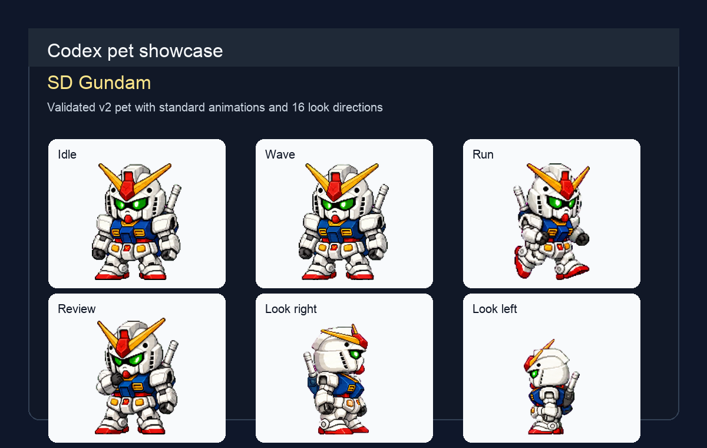

### Animation Previews

| State | Preview |
| --- | --- |
| Idle | 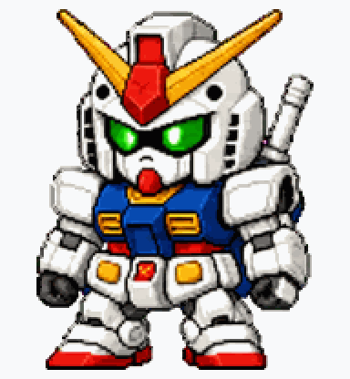 |
| Run right / walk right | 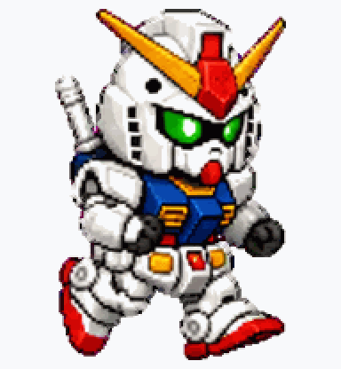 |
| Run left / walk left | 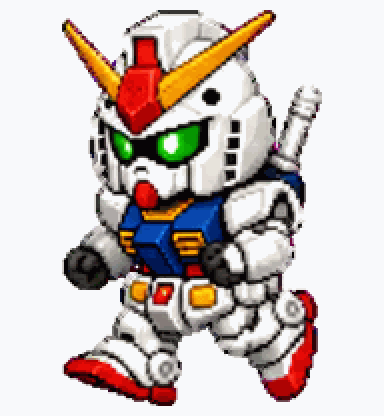 |
| Wave / emote | 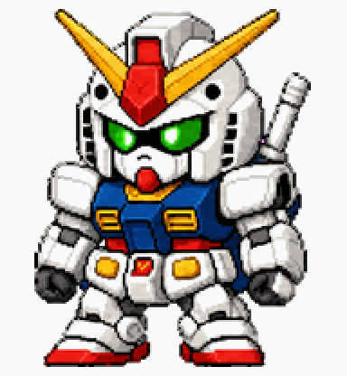 |
| Jump | 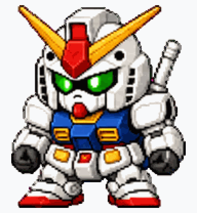 |
| Failed / sad emote | 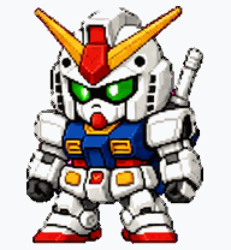 |
| Waiting | 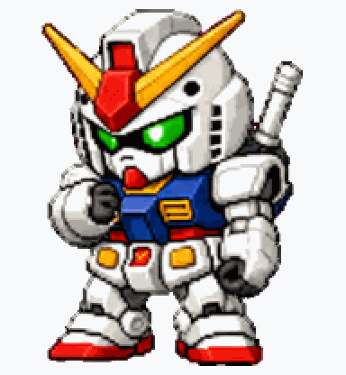 |
| Running / active work | 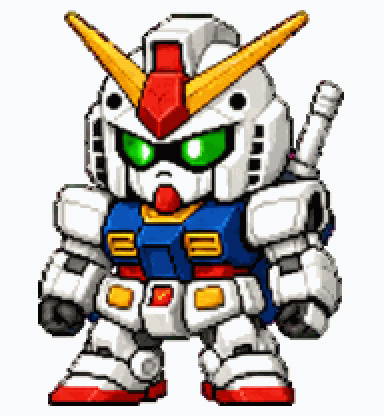 |
| Review / scanning | 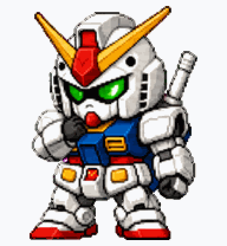 |
| 16 look directions | 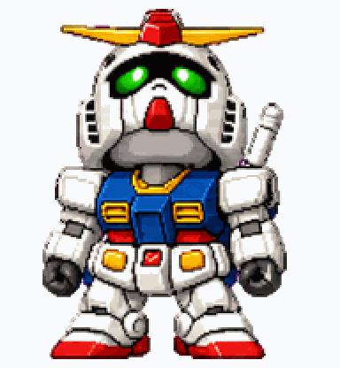 |

### Sprite Sheet QA

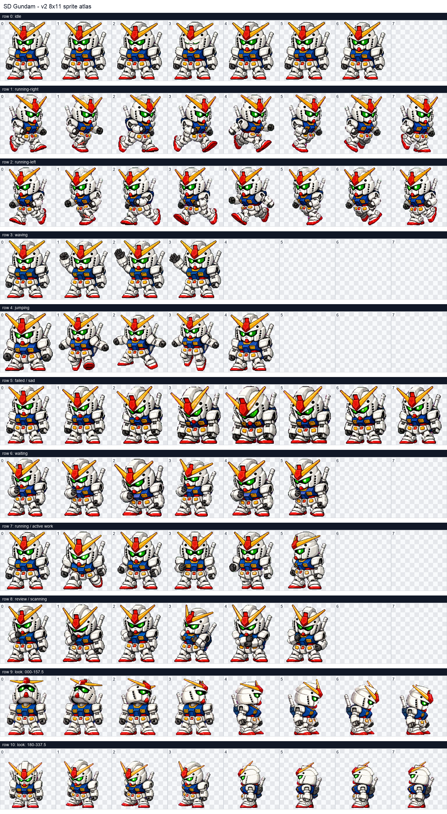

## Chibi Asuka

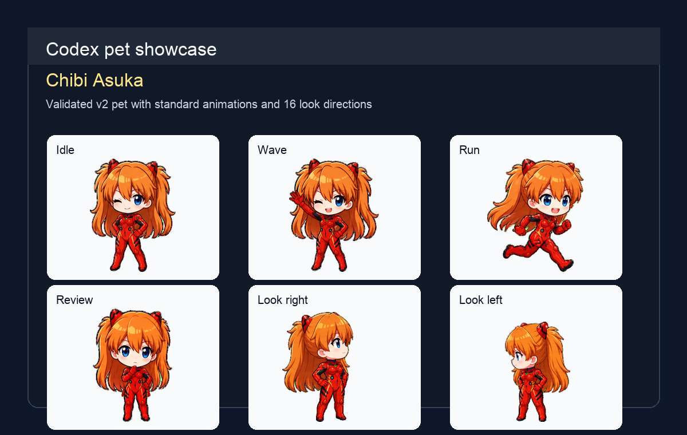

### Animation Previews

| State | Preview |
| --- | --- |
| Idle |  |
| Run right / walk right |  |
| Run left / walk left |  |
| Wave / emote |  |
| Jump |  |
| Failed / sad emote |  |
| Waiting |  |
| Running / active work |  |
| Review / scanning |  |
| 16 look directions |  |

### Sprite Sheet QA

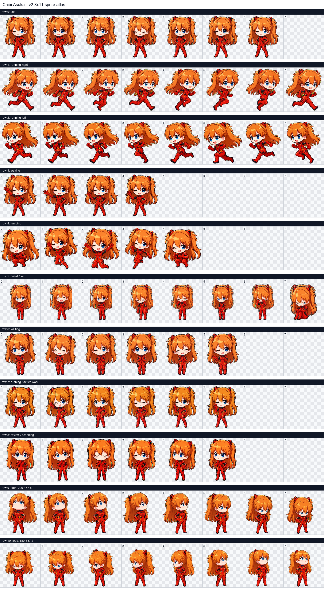

## Chibi Miku

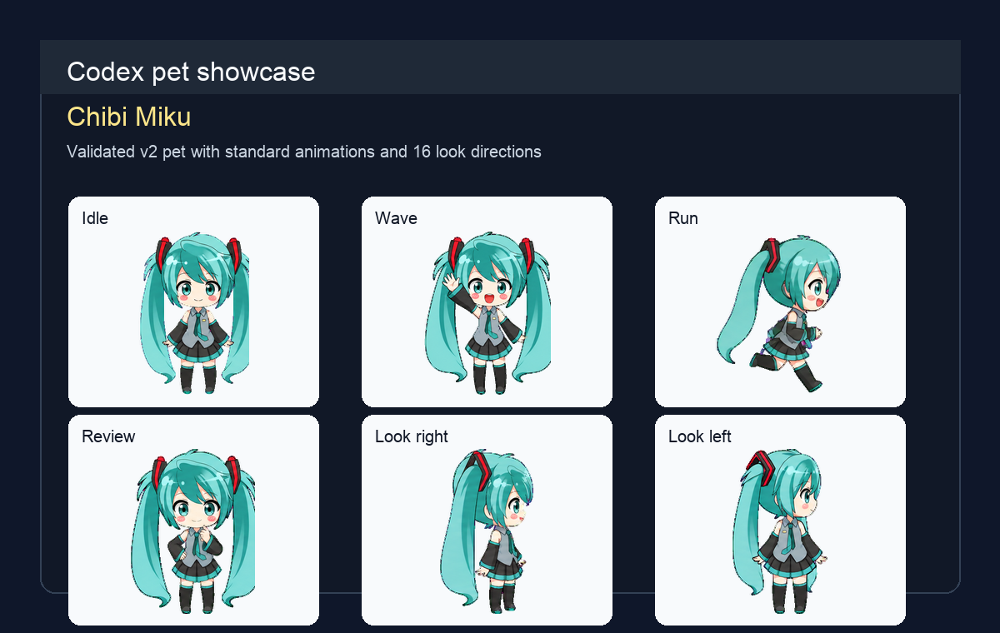

### Animation Previews

| State | Preview |
| --- | --- |
| Idle |  |
| Run right / walk right |  |
| Run left / walk left |  |
| Wave / happy emote |  |
| Jump / excited |  |
| Failed / sad emote |  |
| Waiting / thinking |  |
| Running / active work |  |
| Review / celebrate |  |
| Sleep showcase |  |
| 16 look directions |  |

### Combined Preview

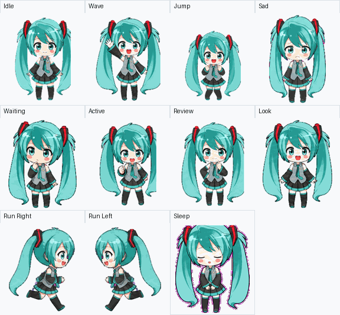

### Sprite Sheet QA

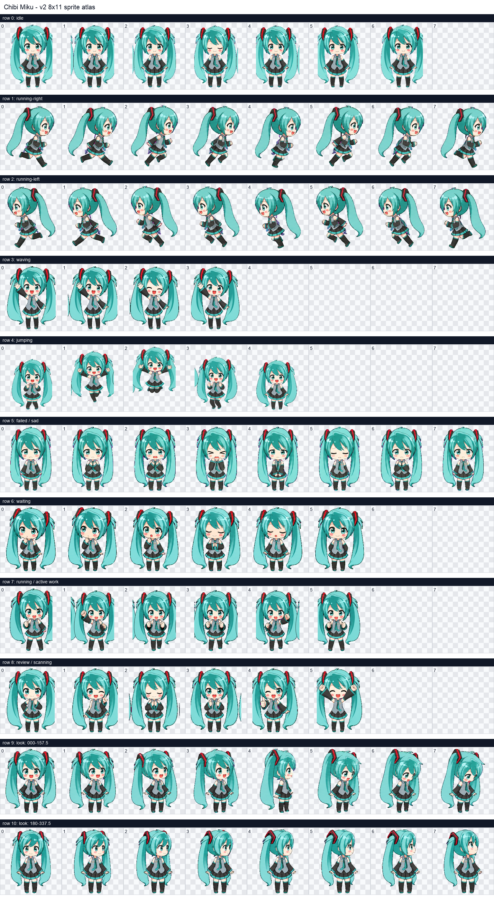

## Animation Summary

| Codex row | State | Frames | Purpose |
| --- | --- | ---: | --- |
| 0 | `idle` | 6 | Resting loop with subtle breathing/blink variation |
| 1 | `running-right` | 8 | Directional movement to the right, useful for walk/run drag motion |
| 2 | `running-left` | 8 | Directional movement to the left, useful for walk/run drag motion |
| 3 | `waving` | 4 | Friendly wave emote |
| 4 | `jumping` | 5 | Vertical jump/bounce action |
| 5 | `sad` / failed | 8 | Failure or sad reaction emote |
| 6 | `waiting` | 6 | Waiting for user input or approval |
| 7 | `running` | 6 | Active work / processing loop |
| 8 | `bouncing` / review | 6 | Review, scanning, or focused work loop |
| 9 | look directions `000` to `157.5` | 8 | Up through right and down-right gaze directions |
| 10 | look directions `180` to `337.5` | 8 | Down through left and up-left gaze directions |

There is no dedicated attack row in the Codex pet contract used here. Combat-style actions should map to the existing jump, wave/emote, sad/failed, or active-work loops unless a future renderer adds a formal attack state.

## Installation

Copy either pet folder into your local Codex pets directory:

```bash
mkdir -p ~/.codex/pets
cp -R pets/sd-gundam-codex-pet ~/.codex/pets/
cp -R pets/chibi-asuka ~/.codex/pets/
cp -R pets/chibi-miku ~/.codex/pets/
```

Each pet folder contains:

```text
pet.json
avatar.json
assets/spritesheet.webp
```

The manifests point to `assets/spritesheet.webp` and declare `spriteVersionNumber: 2`, so Codex can load the 11-row v2 atlas including look directions.

## Validation

Both installed source atlases were validated with the hatch-pet atlas validator before this repo was prepared:

| Pet | Result | Dimensions | Notes |
| --- | --- | --- | --- |
| SD Gundam | Pass | `1536x2288` | No clipping, no transparent RGB residue, no validator warnings |
| Chibi Asuka | Pass | `1536x2288` | No clipping, no transparent RGB residue, no validator warnings |
| Chibi Miku | Pass | `1536x2288` | No clipping, no transparent RGB residue, no validator warnings; sad/failed row regenerated to remove hair ghosting and alignment drift |

The generated contact sheets above are rendered directly from the committed `assets/spritesheet.webp` files. Empty cells are intentional unused slots in variable-length animation rows; populated cells are clipped to `192x208` and render on transparent backgrounds.

## Regenerate Showcase Assets

The preview GIFs, screenshots, and contact sheets can be regenerated from the committed spritesheets:

```bash
python3 tools/render_showcase_assets.py
```

The script does not alter the pet manifests or sprite sheets; it only refreshes files under `showcase/`.
